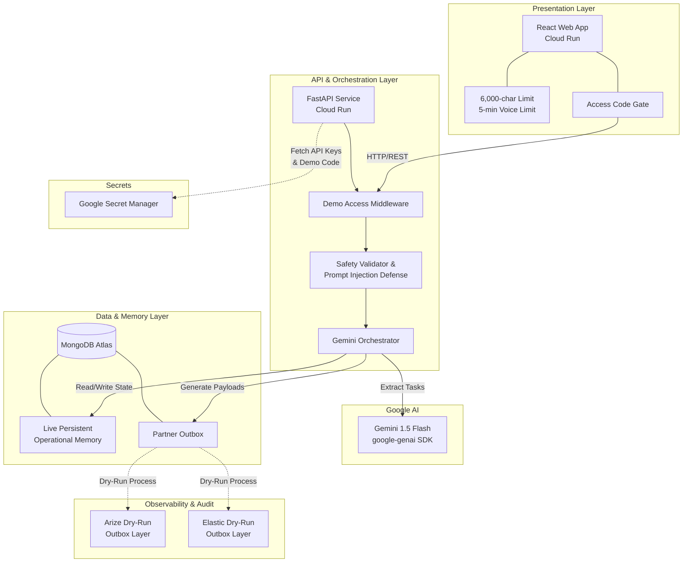

# Final Architecture Summary

## Overview
The MyuKura CareOps Memory Agent is designed as a secure, decoupled, and highly observable system deployed on Google Cloud infrastructure. It emphasizes strict safety boundaries, persistent operational memory, and non-blocking partner integrations.

**IMPORTANT BOUNDARIES:**
*   **Arize and Elastic are not externally activated.** Payloads are generated into an outbox, but external export/indexing is disabled for the public demo.
*   **No real patient data** is used or processed. The demo is strictly synthetic.
*   **No real external delivery** occurs.
*   **Human review is always required** for any generated CareOps tasks.

## Architecture Diagram

## Component Details

### 1. Cloud Run Web
A React-based single-page application hosted on Google Cloud Run. It provides the workspace interface for clinical staff. Features include:
*   Secure Access Gate overlay preventing unauthorized use.
*   Client-side safety constraints: 6,000-character input limit and 5-minute voice recording limit.
*   Real-time polling for agent execution status and memory retrieval updates.

### 2. Cloud Run API
A FastAPI Python backend hosted on Google Cloud Run. It orchestrates the AI logic and database interactions.
*   Protected by a custom `x-demo-access-code` middleware.
*   Enforces server-side constraints (413 Payload Too Large for oversized notes).
*   Manages background simulations and the asynchronous processing pipeline.

### 3. Secret Manager
Google Secret Manager securely provisions the `DEMO_ACCESS_CODE` and `GEMINI_API_KEY`. These are injected into the Cloud Run container environment securely, preventing keys from being committed to the codebase or exposed in the UI.

### 4. Gemini 1.5 Flash
The core intelligence engine accessed via the `google-genai` SDK. It extracts structured operational tasks from unstructured clinical notes. It is fortified by a dual-layer safety validator that rejects prompt injections or clinical diagnosis requests safely before full processing.

### 5. MongoDB Atlas
Serves as the system's live persistent operational memory. When a returning patient note is processed, the backend queries MongoDB for past operational tasks and injects this historical context into the Gemini prompt, ensuring continuity of care operations.

### 6. PartnerOutbox Pattern
To prevent third-party API latency or failures from blocking the critical path, we use the Transactional Outbox pattern. 
*   **Arize Dry-Run/Outbox Layer:** Generates AI observability evaluation payloads.
*   **Elastic Dry-Run/Outbox Layer:** Generates audit-search index payloads.
*   *Status:* Both partners generate ready-to-ship payloads in MongoDB, but the background worker performs a "dry-run" where external export/indexing is strictly disabled for public safety.
